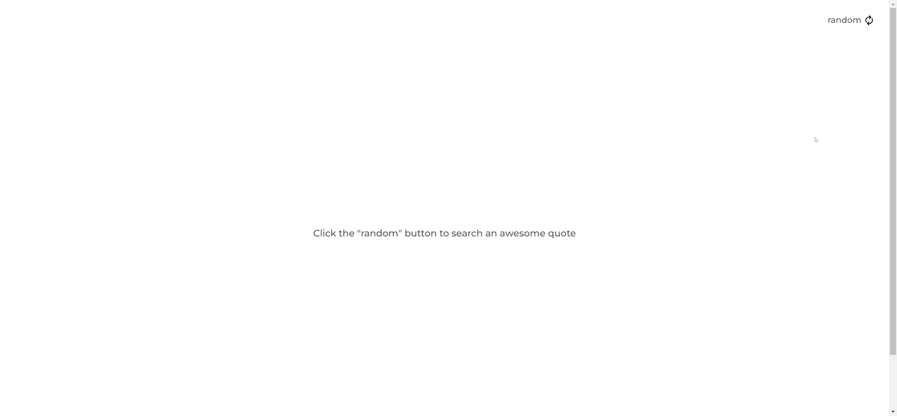

<h1 align="center">Random Quote Generator - Challenge</h1>

<div align="center">
   Solution for the Random Quote Generator Challenge using React.js - carlos.pabon.code - <a href="http://devchallenges.io" target="_blank">Devchallenges.io</a>.
</div>

<div align="center">

  <h3>
    <a href="https://ubiquitous-tapioca-8db476.netlify.app/#/">
      Solution
    </a>
    <span> | </span>
    <a href="https://devchallenges.io/challenges/8Y3J4ucAMQpSnYTwwWW8">
      Challenge
    </a>
  </h3>
</div>

## Table of Contents

- [Overview](#overview)
  - [Built With](#built-with)
- [Features](#features)

## Overview

I made this challenge using React js 18.0.0 and the quotable API (https://github.com/lukePeavey/quotable). I started with the design and development of the main page to generate a random quote after the user clicks the button. Then I designed and developed the author's quotes page. I worked on the details such as showing a loader while a quote is obtained, navigation to the quotes page and animation on the hover state for the author's information.

### Built With

- [React.js 18.0.0](https://es.reactjs.org/)
- [Vite](https://vitejs.dev/)

```sh
yarn create vite
```

- [api.quotable.io] (https://github.com/lukePeavey/quotable)

- [Styled components](https://styled-components.com/)

```sh
yarn add styled-components
```

- [react-router] (https://reactrouter.com/docs/en/v6)

```sh
yarn add react-router-dom@6
```

- [Hero Icons](https://heroicons.com/)

## Features

In this project you can generate a random quote by clicking the button in the upper right corner of the page, after the quote is generated you can see the author and genre of the quote. Finally, if you clicked the author's name, it will show you 5 random quotes of the author.

Here is a gif to see the challenge in action:


